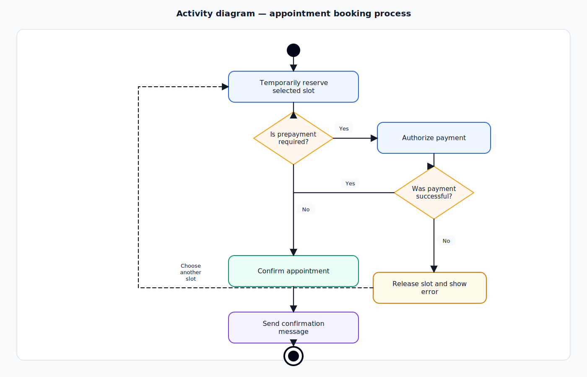

# MediVisit — UML Business Analysis Case Study

> **PL:** Profesjonalne studium przypadku z analizy biznesowej i UML dla systemu rezerwacji wizyt medycznych online.  
> **EN:** Professional Business Analysis and UML case study for an online medical appointment booking system.


---

## 🇵🇱 Wersja polska

### 1. Cel projektu

**MediVisit** to case study systemu umożliwiającego pacjentom rezerwację wizyt medycznych online, a placówce medycznej zarządzanie dostępnością specjalistów, potwierdzeniami wizyt i procesem płatności.

Projekt pokazuje sposób pracy **Analityka Biznesowego / IT Business Analysta**: od kontekstu biznesowego i zakresu, przez wymagania oraz przypadki użycia, aż po spójny zestaw diagramów UML przygotowanych w formacie **draw.io / diagrams.net**.

### 2. Problem biznesowy

Placówka medyczna obsługuje rezerwacje wizyt przez telefon, e-mail i recepcję. Powoduje to błędy w dostępności terminów, opóźnienia w potwierdzeniach, brak spójnej historii zmian oraz trudność w egzekwowaniu przedpłat dla wybranych usług.

Celem rozwiązania jest cyfryzacja procesu rezerwacji wizyt, ograniczenie pracy manualnej oraz zapewnienie pacjentom przejrzystego procesu wyboru terminu, płatności i potwierdzenia wizyty.

### 3. Zakres analizy

**W zakresie projektu:**

- rezerwacja wizyty przez pacjenta,
- wyszukiwanie specjalisty i dostępnego terminu,
- tymczasowa blokada terminu podczas procesu rezerwacji,
- obsługa przedpłaty dla wybranych usług,
- potwierdzenie wizyty i wysłanie powiadomienia,
- anulowanie wizyty,
- podstawowy panel administracyjny dla personelu placówki.

**Poza zakresem:**

- pełna dokumentacja medyczna pacjenta,
- e-recepty i integracja z systemami państwowymi,
- zaawansowane rozliczenia księgowe,
- aplikacja mobilna jako osobny kanał.

### 4. Rola analityka

W projekcie przyjęto perspektywę analityka odpowiedzialnego za:

- identyfikację interesariuszy,
- zdefiniowanie problemu biznesowego,
- opis zakresu MVP,
- zebranie wymagań biznesowych, funkcjonalnych i niefunkcjonalnych,
- przygotowanie przypadków użycia,
- modelowanie procesów i struktury systemu w UML,
- przygotowanie macierzy śladowania wymagań,
- opis reguł biznesowych, ryzyk i założeń.

### 5. Artefakty analityczne

| Obszar | Artefakt | Link |
|---|---|---|
| Kontekst biznesowy | Business context | [docs/pl/01_kontekst_biznesowy.md](docs/pl/01_kontekst_biznesowy.md) |
| Zakres i interesariusze | Scope & stakeholders | [docs/pl/02_zakres_i_interesariusze.md](docs/pl/02_zakres_i_interesariusze.md) |
| Wymagania | Business, functional, non-functional requirements | [docs/pl/03_wymagania.md](docs/pl/03_wymagania.md) |
| Przypadki użycia | Use case specifications | [docs/pl/04_przypadki_uzycia.md](docs/pl/04_przypadki_uzycia.md) |
| Reguły biznesowe | Business rules | [docs/pl/05_reguly_biznesowe.md](docs/pl/05_reguly_biznesowe.md) |
| Śladowanie | Traceability matrix | [docs/pl/06_macierz_sladowania.md](docs/pl/06_macierz_sladowania.md) |
| Ryzyka | Risks and assumptions | [docs/pl/07_ryzyka_i_zalozenia.md](docs/pl/07_ryzyka_i_zalozenia.md) |
| Słownik | Glossary | [docs/pl/08_slownik.md](docs/pl/08_slownik.md) |
| Backlog | User stories and acceptance criteria | [backlog/pl/user_stories.md](backlog/pl/user_stories.md) |

### 6. Diagramy UML — wersja polska

Diagramy są dostępne jako:

- **SVG** — czytelny podgląd na GitHubie,
- **draw.io** — wersja edytowalna w diagrams.net.

| Diagram | Podgląd SVG | Plik draw.io |
|---|---|---|
| Diagram przypadków użycia | [SVG](diagrams/svg/pl/01_diagram_przypadkow_uzycia.svg) | [draw.io](diagrams/drawio/pl/01_diagram_przypadkow_uzycia.drawio) |
| Diagram aktywności | [SVG](diagrams/svg/pl/02_diagram_aktywnosci.svg) | [draw.io](diagrams/drawio/pl/02_diagram_aktywnosci.drawio) |
| Diagram sekwencji | [SVG](diagrams/svg/pl/03_diagram_sekwencji.svg) | [draw.io](diagrams/drawio/pl/03_diagram_sekwencji.drawio) |
| Diagram klas | [SVG](diagrams/svg/pl/04_diagram_klas.svg) | [draw.io](diagrams/drawio/pl/04_diagram_klas.drawio) |
| Diagram stanów | [SVG](diagrams/svg/pl/05_diagram_stanow.svg) | [draw.io](diagrams/drawio/pl/05_diagram_stanow.drawio) |
| Diagram komponentów | [SVG](diagrams/svg/pl/06_diagram_komponentow.svg) | [draw.io](diagrams/drawio/pl/06_diagram_komponentow.drawio) |

#### Podgląd: diagram aktywności


### 7. Kompetencje pokazane w projekcie

- analiza biznesowa i systemowa,
- modelowanie UML,
- wymagania funkcjonalne i niefunkcjonalne,
- specyfikacja przypadków użycia,
- reguły biznesowe,
- user stories i acceptance criteria,
- traceability matrix,
- komunikacja PL/EN w dokumentacji projektowej.

---

## 🇬🇧 English version

### 1. Project purpose

**MediVisit** is a case study of an online medical appointment booking system that allows patients to book visits online and helps a healthcare provider manage specialist availability, appointment confirmations and payment handling.

The project demonstrates the work of a **Business Analyst / IT Business Analyst**: from business context and scope definition, through requirements and use cases, to a consistent set of UML diagrams prepared in **draw.io / diagrams.net** format.

### 2. Business problem

The medical provider handles appointment booking through phone calls, e-mail and reception desk operations. This creates availability errors, delayed confirmations, limited change history and difficulty enforcing prepayments for selected services.

The target solution digitizes the appointment booking process, reduces manual work and gives patients a transparent flow for selecting a slot, completing payment and receiving confirmation.

### 3. Scope of analysis

**In scope:**

- appointment booking by a patient,
- searching for a specialist and an available slot,
- temporary slot reservation during booking,
- prepayment handling for selected services,
- appointment confirmation and notification sending,
- appointment cancellation,
- basic administration panel for clinic staff.

**Out of scope:**

- complete electronic medical records,
- e-prescriptions and national healthcare integrations,
- advanced accounting settlement,
- separate mobile application channel.

### 4. Analyst role

The project is written from the perspective of an analyst responsible for:

- stakeholder identification,
- business problem definition,
- MVP scope description,
- business, functional and non-functional requirements,
- use case specifications,
- UML process and system modelling,
- requirements traceability,
- business rules, risks and assumptions.

### 5. Business analysis artefacts

| Area | Artefact | Link |
|---|---|---|
| Business context | Business context | [docs/en/01_business_context.md](docs/en/01_business_context.md) |
| Scope and stakeholders | Scope & stakeholders | [docs/en/02_scope_and_stakeholders.md](docs/en/02_scope_and_stakeholders.md) |
| Requirements | Business, functional, non-functional requirements | [docs/en/03_requirements.md](docs/en/03_requirements.md) |
| Use cases | Use case specifications | [docs/en/04_use_cases.md](docs/en/04_use_cases.md) |
| Business rules | Business rules | [docs/en/05_business_rules.md](docs/en/05_business_rules.md) |
| Traceability | Traceability matrix | [docs/en/06_traceability_matrix.md](docs/en/06_traceability_matrix.md) |
| Risks | Risks and assumptions | [docs/en/07_risks_and_assumptions.md](docs/en/07_risks_and_assumptions.md) |
| Glossary | Glossary | [docs/en/08_glossary.md](docs/en/08_glossary.md) |
| Backlog | User stories and acceptance criteria | [backlog/en/user_stories.md](backlog/en/user_stories.md) |

### 6. UML diagrams — English version

The diagrams are available as:

- **SVG** — readable GitHub preview,
- **draw.io** — editable diagrams.net source files.

| Diagram | SVG preview | draw.io file |
|---|---|---|
| Use case diagram | [SVG](diagrams/svg/en/01_use_case_diagram.svg) | [draw.io](diagrams/drawio/en/01_use_case_diagram.drawio) |
| Activity diagram | [SVG](diagrams/svg/en/02_activity_diagram.svg) | [draw.io](diagrams/drawio/en/02_activity_diagram.drawio) |
| Sequence diagram | [SVG](diagrams/svg/en/03_sequence_diagram.svg) | [draw.io](diagrams/drawio/en/03_sequence_diagram.drawio) |
| Class diagram | [SVG](diagrams/svg/en/04_class_diagram.svg) | [draw.io](diagrams/drawio/en/04_class_diagram.drawio) |
| State machine diagram | [SVG](diagrams/svg/en/05_state_machine_diagram.svg) | [draw.io](diagrams/drawio/en/05_state_machine_diagram.drawio) |
| Component diagram | [SVG](diagrams/svg/en/06_component_diagram.svg) | [draw.io](diagrams/drawio/en/06_component_diagram.drawio) |

#### Preview: activity diagram



### 7. Skills demonstrated

- business and systems analysis,
- UML modelling,
- functional and non-functional requirements,
- use case specification,
- business rules,
- user stories and acceptance criteria,
- traceability matrix,
- bilingual PL/EN project documentation.

---

## Repository structure

```text
clinic-appointment-system-uml-ba-case/
├── README.md
├── docs/
│   ├── pl/
│   └── en/
├── diagrams/
│   ├── svg/
│   │   ├── pl/
│   │   └── en/
│   └── drawio/
│       ├── pl/
│       └── en/
├── backlog/
│   ├── pl/
│   └── en/
├── templates/
│   ├── pl/
│   └── en/
├── LANGUAGE_COVERAGE_CHECKLIST.md
├── GITHUB_WEB_UPDATE_STEPS.md
├── LICENSE
└── .gitignore
```
