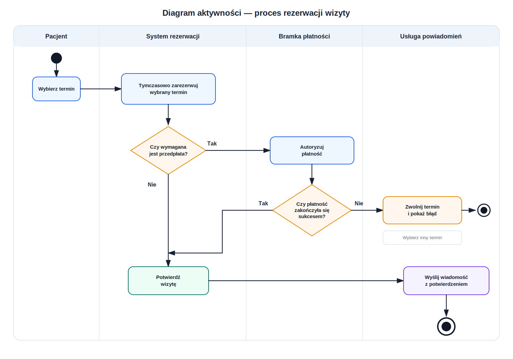
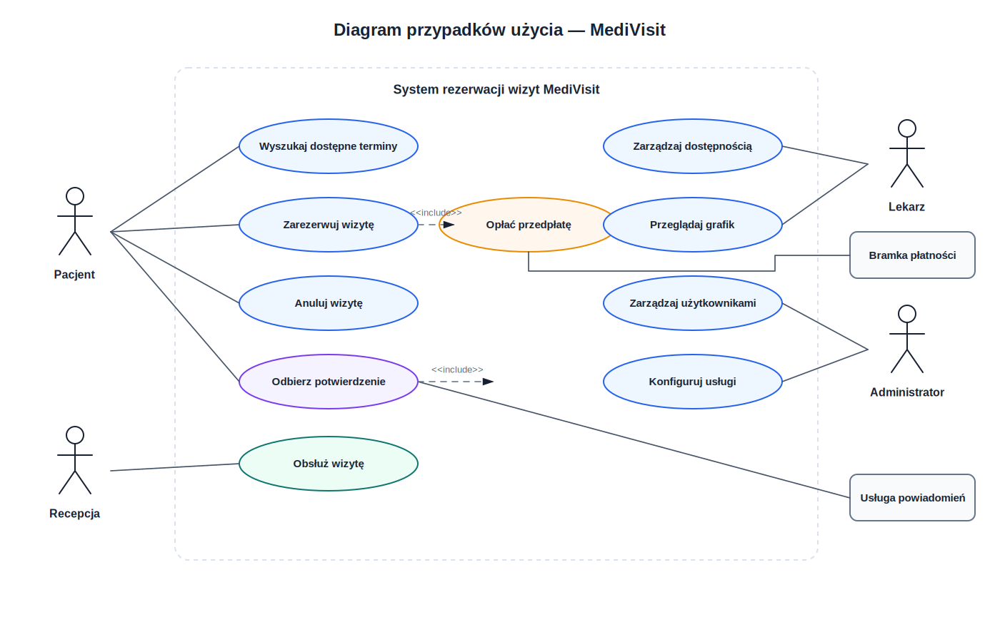
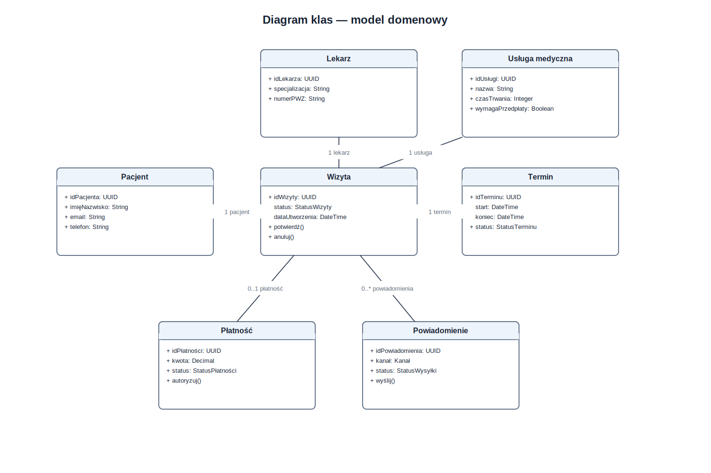
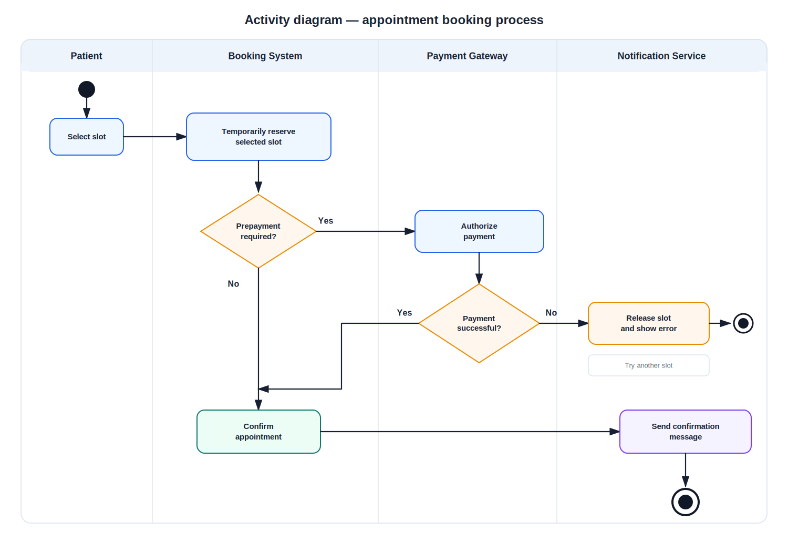
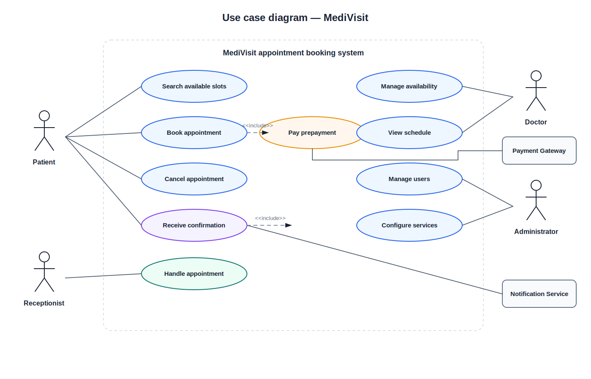
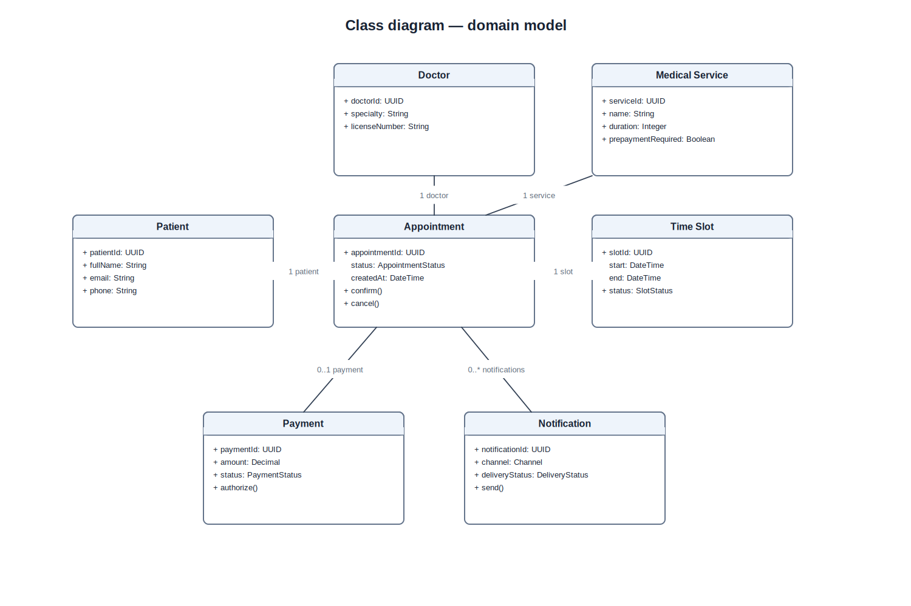

# MediVisit — UML Business Analysis Case Study

## PL — Opis projektu

**MediVisit** to portfolio case study z obszaru **IT Business Analysis**. Projekt opisuje system rezerwacji wizyt medycznych online, obejmując analizę biznesową, wymagania, przypadki użycia, reguły biznesowe, backlog oraz zestaw diagramów UML przygotowanych w dwóch formatach: **draw.io** do edycji i **SVG** do czytelnego podglądu na GitHubie.

Projekt został uporządkowany w dwóch wersjach językowych:

- `docs/pl/` — dokumentacja po polsku,
- `docs/en/` — documentation in English,
- `diagrams/drawio/pl/` i `diagrams/drawio/en/` — edytowalne diagramy draw.io,
- `diagrams/svg/pl/` i `diagrams/svg/en/` — czytelne podglądy diagramów na GitHubie.

### Cel biznesowy

Placówka medyczna chce ograniczyć liczbę telefonicznych rezerwacji, zmniejszyć liczbę pomyłek w grafiku oraz umożliwić pacjentom samodzielne rezerwowanie i anulowanie wizyt. System ma wspierać dostępność lekarzy, potwierdzenia wizyt, opcjonalną przedpłatę oraz powiadomienia SMS/e-mail.

### Zakres analizy

| Obszar | Artefakt |
|---|---|
| Kontekst biznesowy | [`docs/pl/01-kontekst-biznesowy.md`](docs/pl/01-kontekst-biznesowy.md) |
| Zakres i interesariusze | [`docs/pl/02-zakres-i-interesariusze.md`](docs/pl/02-zakres-i-interesariusze.md) |
| Wymagania | [`docs/pl/03-wymagania.md`](docs/pl/03-wymagania.md) |
| Przypadki użycia | [`docs/pl/04-przypadki-uzycia.md`](docs/pl/04-przypadki-uzycia.md) |
| Reguły biznesowe | [`docs/pl/05-reguly-biznesowe.md`](docs/pl/05-reguly-biznesowe.md) |
| Macierz śledzenia | [`docs/pl/06-macierz-sledzenia.md`](docs/pl/06-macierz-sledzenia.md) |
| Ryzyka i założenia | [`docs/pl/07-ryzyka-i-zalozenia.md`](docs/pl/07-ryzyka-i-zalozenia.md) |
| Słownik pojęć | [`docs/pl/08-slownik.md`](docs/pl/08-slownik.md) |
| Backlog | [`backlog/pl/user-stories.md`](backlog/pl/user-stories.md) |

### Diagramy UML — wersja polska

| Diagram | Podgląd SVG | Plik draw.io |
|---|---|---|
| Diagram przypadków użycia | [`SVG`](diagrams/svg/pl/01-diagram-przypadkow-uzycia.svg) | [`draw.io`](diagrams/drawio/pl/01-diagram-przypadkow-uzycia.drawio) |
| Diagram aktywności | [`SVG`](diagrams/svg/pl/02-diagram-aktywnosci-rezerwacja-wizyty.svg) | [`draw.io`](diagrams/drawio/pl/02-diagram-aktywnosci-rezerwacja-wizyty.drawio) |
| Diagram sekwencji | [`SVG`](diagrams/svg/pl/03-diagram-sekwencji-rezerwacja-wizyty.svg) | [`draw.io`](diagrams/drawio/pl/03-diagram-sekwencji-rezerwacja-wizyty.drawio) |
| Diagram klas | [`SVG`](diagrams/svg/pl/04-diagram-klas-model-domenowy.svg) | [`draw.io`](diagrams/drawio/pl/04-diagram-klas-model-domenowy.drawio) |
| Diagram stanów | [`SVG`](diagrams/svg/pl/05-diagram-stanow-wizyta.svg) | [`draw.io`](diagrams/drawio/pl/05-diagram-stanow-wizyta.drawio) |
| Diagram komponentów | [`SVG`](diagrams/svg/pl/06-diagram-komponentow-architektura.svg) | [`draw.io`](diagrams/drawio/pl/06-diagram-komponentow-architektura.drawio) |

### Podgląd kluczowych diagramów

#### Diagram aktywności — proces rezerwacji wizyty

#### Diagram przypadków użycia

#### Diagram klas — model domenowy

### Kompetencje pokazane w projekcie

- modelowanie UML,
- analiza wymagań biznesowych i funkcjonalnych,
- definiowanie przypadków użycia,
- tworzenie reguł biznesowych,
- traceability matrix,
- user stories i acceptance criteria,
- komunikacja analityczna w języku polskim i angielskim,
- przygotowanie dokumentacji pod projekt IT.

### Jak edytować diagramy

Diagramy można otworzyć w **diagrams.net / draw.io**:

1. Wejdź na `app.diagrams.net`.
2. Wybierz `File → Open From → Device`.
3. Otwórz plik z folderu `diagrams/drawio/pl/` albo `diagrams/drawio/en/`.
4. Po edycji wyeksportuj diagram jako SVG i podmień odpowiedni plik w `diagrams/svg/`.

---

## EN — Project description

**MediVisit** is an **IT Business Analysis** portfolio case study. It describes an online medical appointment booking system and includes business analysis documentation, requirements, use cases, business rules, backlog items and UML diagrams prepared in two formats: **draw.io** for editing and **SVG** for GitHub preview.

The project is organized in two language versions:

- `docs/pl/` — documentation in Polish,
- `docs/en/` — documentation in English,
- `diagrams/drawio/pl/` and `diagrams/drawio/en/` — editable draw.io diagrams,
- `diagrams/svg/pl/` and `diagrams/svg/en/` — GitHub-friendly SVG previews.

### Business goal

A medical clinic wants to reduce phone-based bookings, minimize scheduling errors and allow patients to book and cancel appointments online. The system supports doctor availability, appointment confirmations, optional prepayment and SMS/e-mail notifications.

### Analysis scope

| Area | Artifact |
|---|---|
| Business context | [`docs/en/01-business-context.md`](docs/en/01-business-context.md) |
| Scope and stakeholders | [`docs/en/02-scope-and-stakeholders.md`](docs/en/02-scope-and-stakeholders.md) |
| Requirements | [`docs/en/03-requirements.md`](docs/en/03-requirements.md) |
| Use cases | [`docs/en/04-use-cases.md`](docs/en/04-use-cases.md) |
| Business rules | [`docs/en/05-business-rules.md`](docs/en/05-business-rules.md) |
| Traceability matrix | [`docs/en/06-traceability-matrix.md`](docs/en/06-traceability-matrix.md) |
| Risks and assumptions | [`docs/en/07-risks-and-assumptions.md`](docs/en/07-risks-and-assumptions.md) |
| Glossary | [`docs/en/08-glossary.md`](docs/en/08-glossary.md) |
| Backlog | [`backlog/en/user-stories.md`](backlog/en/user-stories.md) |

### UML diagrams — English version

| Diagram | SVG preview | draw.io file |
|---|---|---|
| Use case diagram | [`SVG`](diagrams/svg/en/01-use-case-diagram.svg) | [`draw.io`](diagrams/drawio/en/01-use-case-diagram.drawio) |
| Activity diagram | [`SVG`](diagrams/svg/en/02-activity-book-appointment.svg) | [`draw.io`](diagrams/drawio/en/02-activity-book-appointment.drawio) |
| Sequence diagram | [`SVG`](diagrams/svg/en/03-sequence-book-appointment.svg) | [`draw.io`](diagrams/drawio/en/03-sequence-book-appointment.drawio) |
| Class diagram | [`SVG`](diagrams/svg/en/04-class-domain-model.svg) | [`draw.io`](diagrams/drawio/en/04-class-domain-model.drawio) |
| State machine diagram | [`SVG`](diagrams/svg/en/05-state-appointment.svg) | [`draw.io`](diagrams/drawio/en/05-state-appointment.drawio) |
| Component diagram | [`SVG`](diagrams/svg/en/06-component-architecture.svg) | [`draw.io`](diagrams/drawio/en/06-component-architecture.drawio) |

### Key diagram previews

#### Activity diagram — appointment booking process

#### Use case diagram

#### Class diagram — domain model

### Skills demonstrated

- UML modelling,
- business and functional requirements analysis,
- use case specification,
- business rule definition,
- traceability matrix,
- user stories and acceptance criteria,
- bilingual analytical documentation,
- IT project documentation structure.

### How to edit diagrams

The diagrams can be opened in **diagrams.net / draw.io**:

1. Go to `app.diagrams.net`.
2. Select `File → Open From → Device`.
3. Open a file from `diagrams/drawio/pl/` or `diagrams/drawio/en/`.
4. After editing, export the diagram as SVG and replace the relevant file in `diagrams/svg/`.
