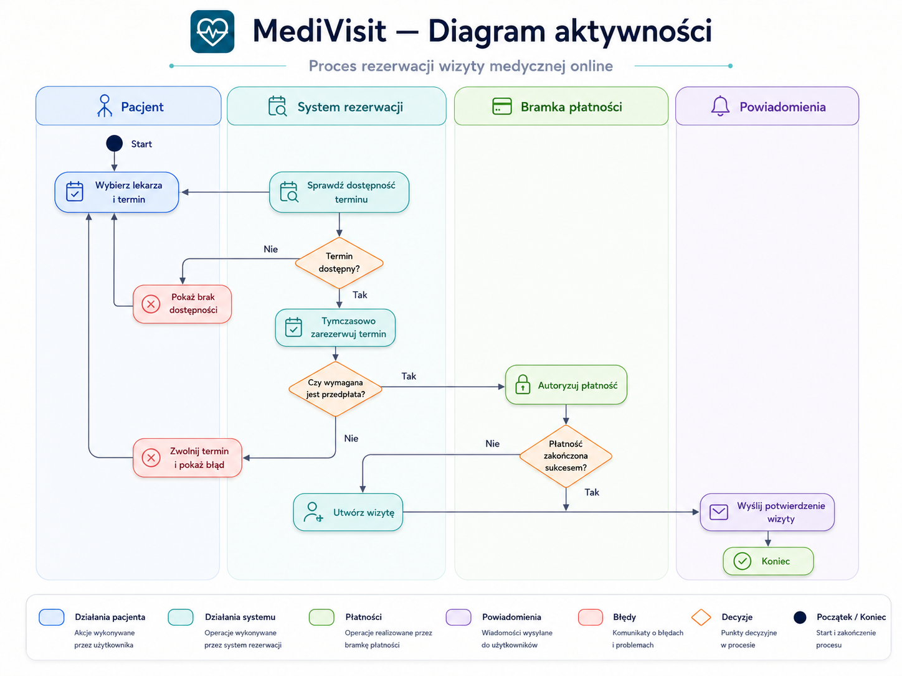
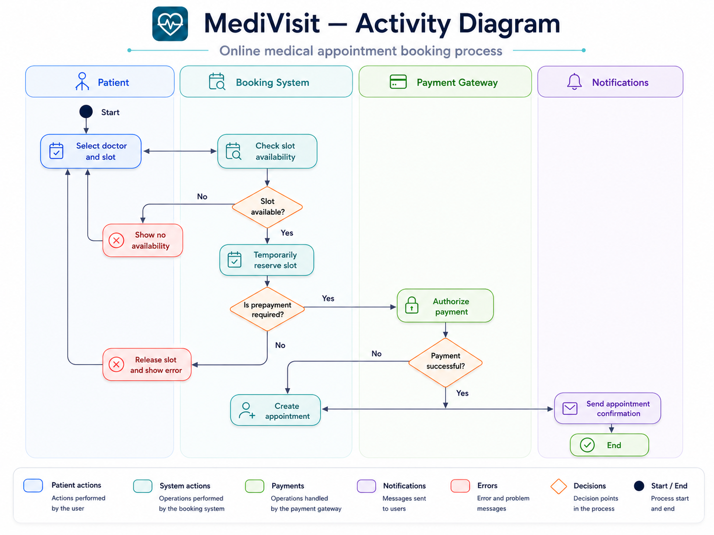

# MediVisit — UML Business Analysis Case Study

> **PL:** Portfolio project dla roli Business Analyst / IT Business Analyst — system rezerwacji wizyt medycznych online.  
> **EN:** Portfolio project for a Business Analyst / IT Business Analyst role — online medical appointment booking system.


---

## 🇵🇱 Wersja polska

### Cel projektu

**MediVisit** to przykładowy system umożliwiający pacjentom rezerwację wizyt medycznych online, a placówce medycznej zarządzanie dostępnością specjalistów, wizytami, płatnościami i powiadomieniami.

Projekt pokazuje sposób pracy analityka biznesowego / IT Business Analysta: identyfikację procesu, aktorów, przypadków użycia, przebiegów systemowych, modelu domenowego, stanów obiektu oraz logicznych komponentów rozwiązania.

### Problem biznesowy

Placówka medyczna obsługuje znaczną część rezerwacji przez telefon, e-mail i recepcję. Powoduje to błędy w dostępności terminów, opóźnienia w potwierdzeniach, brak przejrzystej historii zmian oraz trudność w obsłudze przedpłat dla wybranych usług.

Celem rozwiązania jest cyfryzacja procesu rezerwacji wizyt, ograniczenie pracy manualnej oraz zapewnienie pacjentowi czytelnego procesu wyboru terminu, płatności i potwierdzenia wizyty.

### Zakres analizy

**W zakresie:**

- wyszukiwanie lekarza i dostępnego terminu,
- rezerwacja, zmiana i anulowanie wizyty,
- tymczasowa blokada terminu,
- obsługa płatności online dla wizyt wymagających przedpłaty,
- wysyłka potwierdzeń i przypomnień,
- podstawowe zarządzanie grafikiem lekarzy i użytkownikami.

**Poza zakresem:**

- pełna elektroniczna dokumentacja medyczna,
- e-recepty,
- teleporady wideo,
- pełna księgowość i fakturowanie,
- integracje z publicznymi systemami ochrony zdrowia.

### Diagramy UML — PL

Diagramy są przygotowane w dwóch formatach:

- **PNG** — podgląd bezpośrednio na GitHubie,
- **draw.io** — plik do otwarcia w diagrams.net / draw.io.

| Diagram | Podgląd PNG | Plik draw.io |
|---|---|---|
| Diagram przypadków użycia | [PNG](diagrams/png/pl/01_diagram_przypadkow_uzycia.png) | [draw.io](diagrams/drawio/pl/01_diagram_przypadkow_uzycia.drawio) |
| Diagram aktywności | [PNG](diagrams/png/pl/02_diagram_aktywnosci.png) | [draw.io](diagrams/drawio/pl/02_diagram_aktywnosci.drawio) |
| Diagram sekwencji | [PNG](diagrams/png/pl/03_diagram_sekwencji.png) | [draw.io](diagrams/drawio/pl/03_diagram_sekwencji.drawio) |
| Diagram klas | [PNG](diagrams/png/pl/04_diagram_klas.png) | [draw.io](diagrams/drawio/pl/04_diagram_klas.drawio) |
| Diagram stanów | [PNG](diagrams/png/pl/05_diagram_stanow.png) | [draw.io](diagrams/drawio/pl/05_diagram_stanow.drawio) |
| Diagram komponentów | [PNG](diagrams/png/pl/06_diagram_komponentow.png) | [draw.io](diagrams/drawio/pl/06_diagram_komponentow.drawio) |

#### Podgląd — diagram aktywności



---

## 🇬🇧 English version

### Project purpose

**MediVisit** is a sample online medical appointment booking system. It allows patients to book appointments online and supports a healthcare provider in managing doctor availability, appointments, payments and notifications.

The project demonstrates the work of a Business Analyst / IT Business Analyst: process identification, actors, use cases, system interactions, domain model, object lifecycle and logical solution components.

### Business problem

The healthcare provider handles a large part of appointment booking through phone calls, e-mail and reception desk operations. This causes availability errors, delayed confirmations, limited change history and difficulty handling prepayments for selected services.

The target solution digitizes the appointment booking process, reduces manual work and provides the patient with a clear flow for selecting a slot, completing payment and receiving confirmation.

### Scope of analysis

**In scope:**

- searching for a doctor and available appointment slot,
- booking, changing and cancelling appointments,
- temporary slot reservation,
- online payment handling for appointments requiring prepayment,
- confirmation and reminder notifications,
- basic management of doctor schedules and users.

**Out of scope:**

- full electronic medical records,
- e-prescriptions,
- video consultations,
- full accounting and invoicing,
- integrations with public healthcare systems.

### UML diagrams — EN

The diagrams are prepared in two formats:

- **PNG** — direct GitHub preview,
- **draw.io** — source file for diagrams.net / draw.io.

| Diagram | PNG preview | draw.io file |
|---|---|---|
| Use case diagram | [PNG](diagrams/png/en/01_use_case_diagram.png) | [draw.io](diagrams/drawio/en/01_use_case_diagram.drawio) |
| Activity diagram | [PNG](diagrams/png/en/02_activity_diagram.png) | [draw.io](diagrams/drawio/en/02_activity_diagram.drawio) |
| Sequence diagram | [PNG](diagrams/png/en/03_sequence_diagram.png) | [draw.io](diagrams/drawio/en/03_sequence_diagram.drawio) |
| Class diagram | [PNG](diagrams/png/en/04_class_diagram.png) | [draw.io](diagrams/drawio/en/04_class_diagram.drawio) |
| State machine diagram | [PNG](diagrams/png/en/05_state_machine_diagram.png) | [draw.io](diagrams/drawio/en/05_state_machine_diagram.drawio) |
| Component diagram | [PNG](diagrams/png/en/06_component_diagram.png) | [draw.io](diagrams/drawio/en/06_component_diagram.drawio) |

#### Preview — activity diagram



---

## Repository structure

```text
clinic-appointment-system-uml-ba-case/
├── README.md
└── diagrams/
    ├── png/
    │   ├── pl/
    │   └── en/
    └── drawio/
        ├── pl/
        └── en/
```

## Skills demonstrated

- Business Analysis,
- IT Business Analysis,
- UML modelling,
- use case modelling,
- process modelling,
- sequence modelling,
- domain modelling,
- state modelling,
- component modelling,
- bilingual PL/EN documentation.
